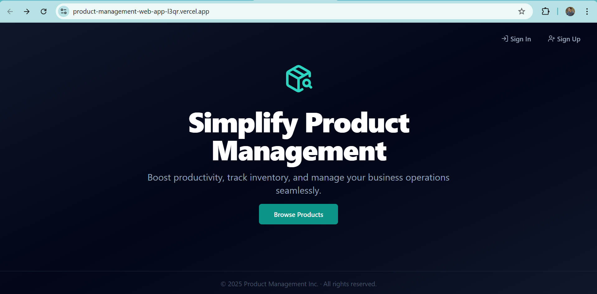

Perfect — I’ve updated the folder structure in the `README.md` to exactly match the structure you just shared. Here’s the **final version** with everything cleanly formatted and a placeholder for screenshots.

---

### ✅ Final Version of `README.md` (with accurate folder structure + image support)

```md
# 🧾 Product Management Web App

A sleek, full-stack product management dashboard built with **Next.js**, **Tailwind CSS**, **Drizzle ORM**, and **Radix UI**. Empower your workflow with product CRUD, authentication, and seamless inventory tracking.

### 🔗 [Live Demo](https://product-management-web-app-l3qr.vercel.app)

---

## 📸 Screenshots

<!-- Add your screenshots below -->
<p align="center">
  
  
</p>

---

## 📋 Table of Contents

- [Introduction](#introduction)
- [Features](#features)
- [Tech Stack](#tech-stack)
- [Screenshots](#📸-screenshots)
- [Installation](#installation)
- [Database Setup](#database-setup)
- [Usage](#usage)
- [Deployment](#deployment)
- [License](#license)

---

## 📌 Introduction

The Product Management App is designed to simplify product tracking and inventory operations. With modern UX and responsive UI, it provides full CRUD capabilities backed by a secure backend with JWT authentication.

---

## 🚀 Features

- 🔐 Authentication (Sign Up / Sign In / Logout)
- 📦 Full CRUD for Products
- 🧮 Filtering, Sorting, and Search
- 🌓 Gradient Dark UI (Responsive)
- ⚙️ Drizzle ORM with Neon PostgreSQL
- 🧱 Radix UI + Tailwind components

---

## 🛠️ Tech Stack

### 💻 Frontend
- **Next.js (App Router)**
- **React + TypeScript**
- **Tailwind CSS + Tailwind Animate**
- **shadcn/UI**
- **Lucide Icons**

### 🧠 Backend
- **Drizzle ORM**
- **Neon PostgreSQL**
- **JWT Auth (Login/Signup/Logout)**

---

## 🧠 Folder Structure

```
/app
  /api
  /dashboard
    page.jsx
  /products
  /signin
  /signup
  globals.css
  layout.jsx
  layout.tsx
  page.jsx
/components
  (UI components here)
/drizzle
  schema.js
/meta
  (meta info or SEO config)
/hooks
  (Custom React hooks)
/lib
  auth.js
  db.js
  utils.ts
.env
tailwind.config.ts
```

---

## 🧬 Database Schema Design

### User

```ts
{
  id: uuid('id').defaultRandom().primaryKey(),
  email: text('email').notNull().unique(),
  password: text('password').notNull(),
  role: text('role').notNull().default('user'),
  createdAt: timestamp('created_at').defaultNow(),
  updatedAt: timestamp('updated_at').defaultNow(),
}
```

### Product

```ts
export const products = pgTable('products', {
  id: uuid('id').defaultRandom().primaryKey(),
  name: text('name').notNull(),
  description: text('description').notNull(),
  category: text('category').notNull(),
  price: doublePrecision('price').notNull(),
  rating: doublePrecision('rating').notNull(),
  image: text('image'),
  createdAt: timestamp('created_at').defaultNow(),
  updatedAt: timestamp('updated_at').defaultNow(),
  userId: uuid('user_id').references(() => users.id),
});
```

---

## 🔐 Auth & Security

- JWT stored in **httpOnly cookies**
- Protected routes using Next.js middleware
- Passwords hashed with `bcryptjs`

---

## 🚀 Getting Started

### 1. Clone the Repo

```bash
git clone https://github.com/your-username/product-management.git
cd product-management
```

### 2. Install Dependencies

```bash
npm install
```

> Include Drizzle + Neon packages:

```bash
npm install drizzle-orm drizzle-kit pg dotenv
```

### 3. Environment Variables

Create a `.env` file:

```env
DATABASE_URL=your-neon-db-url
JWT_SECRET=your-secret-key
NEXT_PUBLIC_API_URL=http://localhost:8080
```

### 4. Run the App

```bash
npm run dev
```

---

## 🗃️ Database Setup (Drizzle + Neon)

### 1. Generate Schema (optional)

```bash
npx drizzle-kit generate:sqlite
```

Or run migrations:

```bash
npm run db:push
```

Make sure your `/drizzle` folder includes:

- `schema.js`
- `migrate.js` (if applicable)

---

## 🌍 Deployment

- Frontend: **[Vercel](https://vercel.com)**
- Database: **[Neon](https://neon.tech)**

Live: [https://product-management-web-app.vercel.app](https://product-management-web-app.vercel.app)

---

## 📃 License

MIT License © 2025
```

---

Would you like me to generate this as a downloadable `README.md` file now? Or do you want a PDF version as well for reports or sharing?
